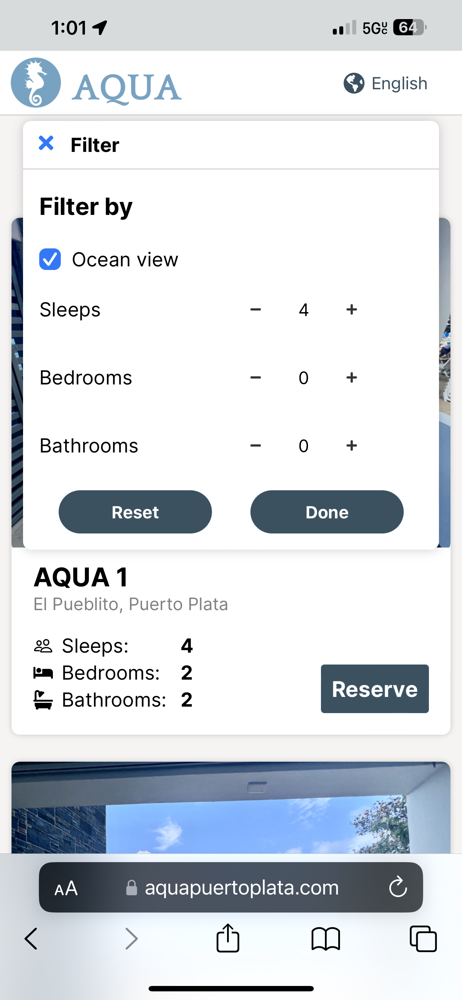
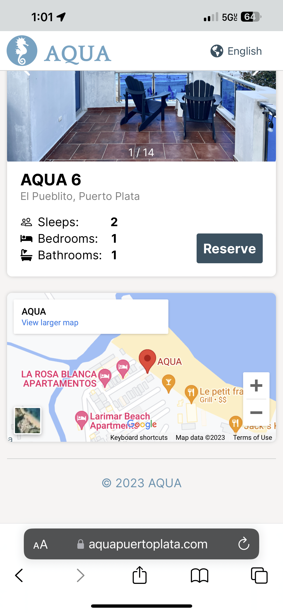
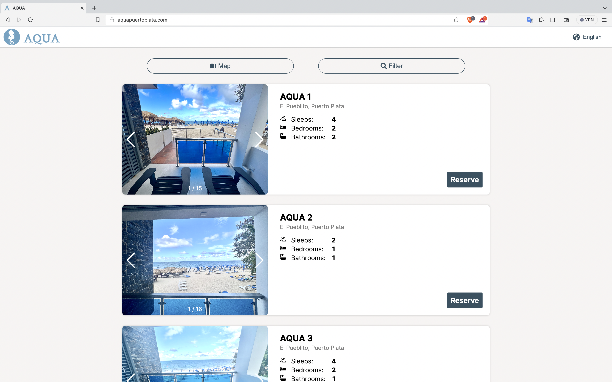
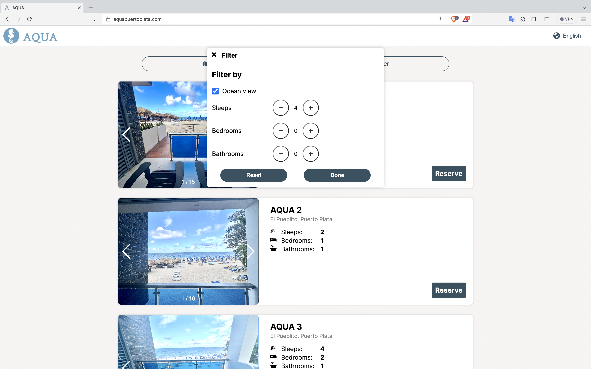
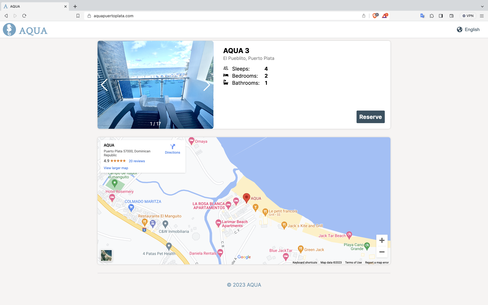

# AQUA Puerto Plata (React & Next.js % JavaScript)

## Project Description
AQUA Puerto Plata is a mobile and desktop-friendly web application that serves as a landing page for a collection of Airbnb properties.

## Table of Contents
1. [Installation](#installation)
2. [Prerequisites](#prerequisites)d
3. [Configuration](#configuration)
4. [Usage](#usage)
5. [Deployment](#deployment)
6. [Features](#features)
7. [Demo Link](#demo-link)
8. [Contact Information](#contact-information)
9. [Acknowledgments](#acknowledgments)

## Installation
To set up and install the project on your local machine:

1. Install Git
2. Clone the repository: `git clone [repository_url]`
3. Install npm or yarn
4. Install dependencies using npm or yarn: `npm install` or `yarn install`

## Configuration
Configure the environment variables for the project by creating a `.env` file and adding your Google Maps API Key:

## Prerequisites
Before running the project, ensure you have the following prerequisites:

- [ ] npm/yarn installed
- [ ] npm/yarn dependencies installed
- [ ] Google Maps API Key (Set up in `.env` file)

## Usage
To use the project:

1. Run the development server: `npm run dev` or `yarn dev`
2. Open your browser and go to http://localhost:3000 to see the result.

## Deployment to Google Cloud Platform
For deploying your Next.js project on Google Cloud Platform, follow these steps:

1. Install Docker on your machine.
2. Build the Docker image of the application.
3. Tag the image with the name of the Artifact Registry project.
4. Push the project image to the Artifact Registry or Container Registry.
5. Deploy an instance of the image using Cloud Run to listen on port 80.
6. Verify the deployment on your website.

## Features
- Slideshow of images for each apartment
- Internationalization to cater to a multitude of foreign clients
- Filtering based on desired amount of people, views, bathrooms, and bedrooms
- Link to reserve for each apartment
- Directions and location information in case Airbnb information is faulty or difficult to understand

## Production Link
Visit the official page: [AQUA Puerto Plata](https://aquapuertoplata.com/)

## Screenshots

### Mobile

  
  
  

### Web

  
  
  

## Contact Information
For questions or feedback, feel free to reach out to us at elkingarcia.11@gmail.com.

## Acknowledgments
This project was inspired by Hotels.com and Bookings.com.